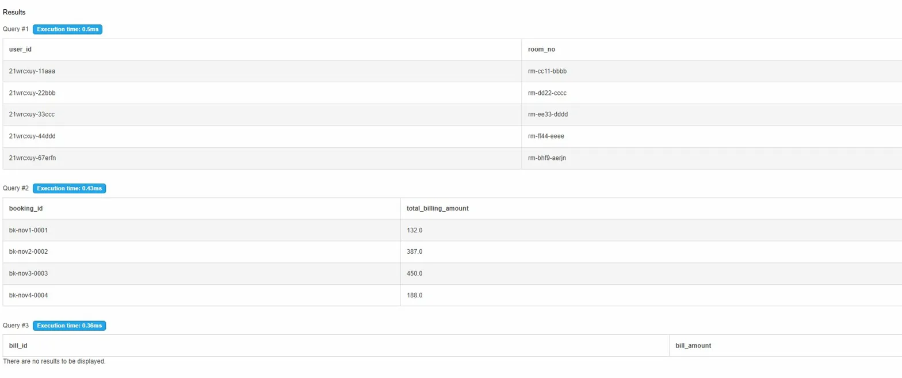
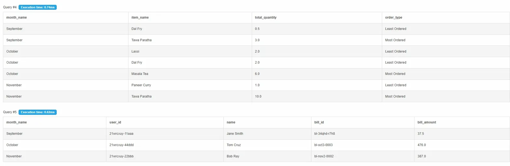
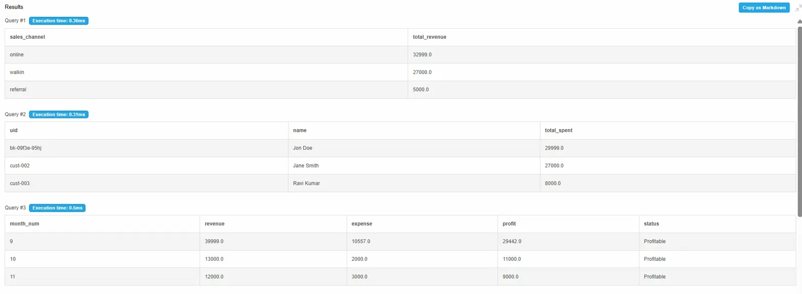
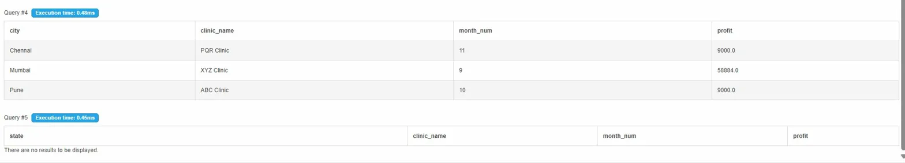
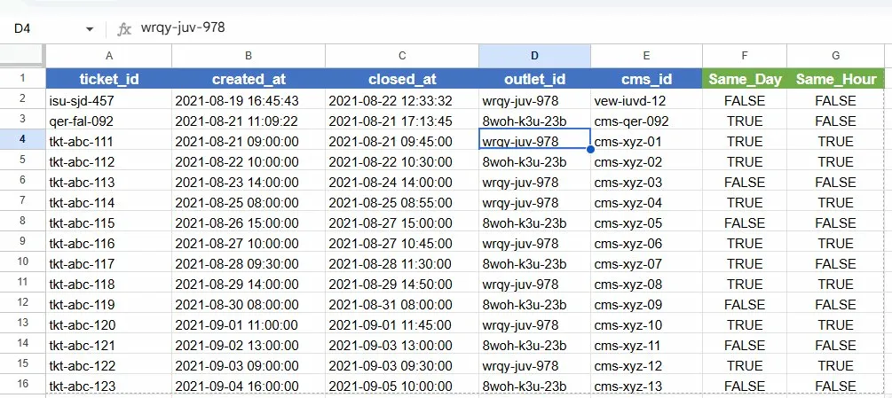
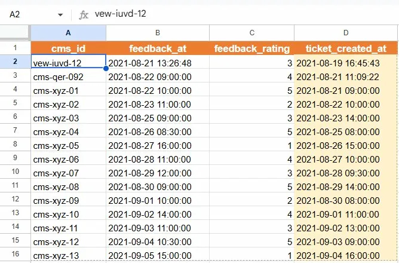
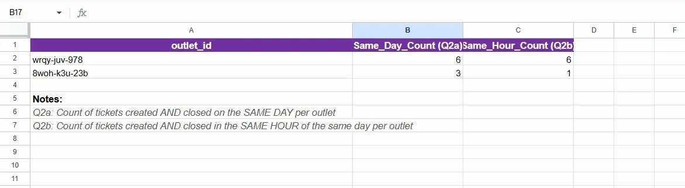
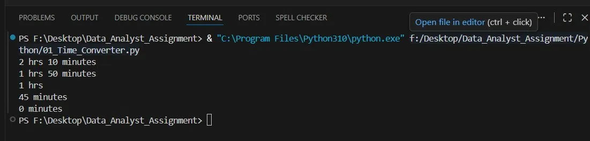
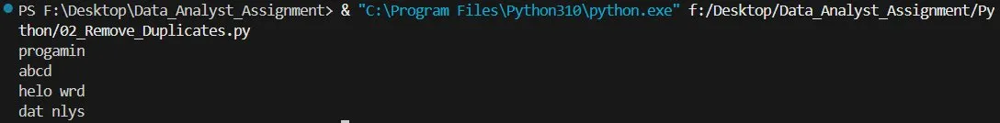

# 📊 PlatinumRx Data Analyst Assignment

---

## 📁 Project Structure

```
PlatinumRx_Assignment/
│
├── SQL/
│   ├── 01_Hotel_Schema_Setup.sql    # Table creation and data insertion for Hotel
│   ├── 02_Hotel_Queries.sql         # Solutions for Part A (Questions 1-5)
│   ├── 03_Clinic_Schema_Setup.sql   # Table creation and data insertion for Clinic
│   └── 04_Clinic_Queries.sql        # Solutions for Part B (Questions 1-5)
│
├── Spreadsheets/
│   └── Ticket_Analysis.xlsx         # Workbook with ticket data and analysis
│
├── Python/
│   ├── 01_Time_Converter.py         # Script to convert minutes to hrs & minutes
│   └── 02_Remove_Duplicates.py      # Script to remove duplicate characters
│
└── README.md                        # Project documentation
```

---

## 🛠️ Tools Used

| Phase | Tool |
|---|---|
| SQL | MySQL Workbench |
| Spreadsheet | Google Sheets / Microsoft Excel |
| Python | VS Code (Python 3.x) |

---

## 📌 Phase 1: SQL Proficiency

### Part A — Hotel Management System

**Tables Created:**
- `users` — stores user details
- `bookings` — stores room booking info
- `items` — stores food/service items with rates
- `booking_commercials` — stores bill details per booking

**Queries Solved:**

| Question | Description | Key Concept Used |
|---|---|---|
| Q1 | Last booked room per user | MAX(), Subquery |
| Q2 | Total billing in November 2021 | JOIN, SUM(), WHERE |
| Q3 | Bills > 1000 in October 2021 | GROUP BY, HAVING |
| Q4 | Most and least ordered item per month | Window Function, RANK() |
| Q5 | Customer with 2nd highest bill per month | DENSE_RANK() |

### 📸 Hotel System Query Results

**Query 1, 2, 3 Results:**



**Query 4, 5 Results:**



---

### Part B — Clinic Management System

**Tables Created:**
- `clinics` — stores clinic details with city and state
- `customer` — stores customer info
- `clinic_sales` — stores sales transactions
- `expenses` — stores clinic expense records

**Queries Solved:**

| Question | Description | Key Concept Used |
|---|---|---|
| Q1 | Revenue per sales channel | GROUP BY, SUM() |
| Q2 | Top 10 most valuable customers | ORDER BY, LIMIT |
| Q3 | Month-wise revenue, expense, profit | CTE, JOIN, CASE |
| Q4 | Most profitable clinic per city per month | RANK(), Window Function |
| Q5 | 2nd least profitable clinic per state | DENSE_RANK() |

### 📸 Clinic System Query Results

**Query 1, 2, 3 Results:**



**Query 4, 5 Results:**



---

## 📌 Phase 2: Spreadsheet Proficiency

### File: `Ticket_Analysis.xlsx`

**Sheets Inside:**

| Sheet Name | Contents |
|---|---|
| `ticket` | Raw ticket data with helper columns |
| `feedbacks` | Feedback data with INDEX-MATCH formula |
| `Analysis` | Outlet-wise count results |

---

### Q1 — Populate ticket_created_at in feedbacks sheet

**Approach:** Used **INDEX + MATCH** formula to look up `created_at` from ticket sheet using `cms_id` as the key

**Formula used:**
```
=IFERROR(INDEX(ticket!$B:$B,MATCH(A2,ticket!$E:$E,0)),"Not Found")
```

---

### Q2a — Count tickets created AND closed on same day per outlet

**Approach:** Added helper column `Same_Day` in ticket sheet:
```
=INT(B2)=INT(C2)
```
Counted per outlet using:
```
=COUNTIFS(ticket!$D:$D, A2, ticket!$F:$F, TRUE)
```

---

### Q2b — Count tickets created AND closed in same hour per outlet

**Approach:** Added helper column `Same_Hour` in ticket sheet:
```
=AND(INT(B2)=INT(C2), HOUR(B2)=HOUR(C2))
```
Counted per outlet using:
```
=COUNTIFS(ticket!$D:$D, A2, ticket!$G:$G, TRUE)
```

### 📸 Spreadsheet Results

**Ticket Sheet with Helper Columns:**



**Feedbacks Sheet with INDEX-MATCH:**



**Analysis Sheet — Outlet wise Counts:**



---

## 📌 Phase 3: Python Proficiency

### Script 1 — `01_Time_Converter.py`

**Goal:** Convert total minutes into human readable format

**Logic:**
- Hours = total_minutes // 60
- Remaining Minutes = total_minutes % 60

**Example:**
```
Input  → 130       Output → 2 hrs 10 minutes
Input  → 110       Output → 1 hrs 50 minutes
Input  → 60        Output → 1 hrs
Input  → 45        Output → 45 minutes
```

### 📸 Time Converter Output



---

### Script 2 — `02_Remove_Duplicates.py`

**Goal:** Remove duplicate characters from a string using a loop

**Logic:**
- Loop through each character
- Add to result only if not already present

**Example:**
```
Input  → "programming"     Output → "progamin"
Input  → "aabbccdd"        Output → "abcd"
Input  → "hello world"     Output → "helo wrd"
Input  → "data analyst"    Output → "dat nlys"
```

### 📸 Remove Duplicates Output



---

## 🔗 Submission Links

- **GitHub Repository:** https://github.com/YourUsername/PlatinumRx_Assignment
- **Spreadsheet Link:** https://docs.google.com/spreadsheets/d/1jSYAooGKp7fOEjVgQxSEgqZ1F-fhDhjCPQOvZvVDJXE/edit?usp=sharing
- **Screen Recording:** https://drive.google.com/yourlink
